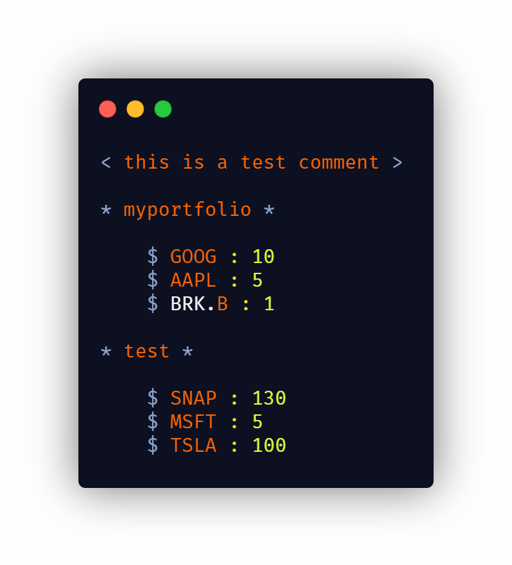

<h1 align="center">
	
</h1>
<h3 align="center">
	qsml is a markup language for securities by symbol and amount of shares
</h3>
<p align="center">
	<strong>
		<a href="https://pypi.org/project/qsml/">PyPi</a>
		•
		<a href="https://marketplace.visualstudio.com/items?itemName=michaelpeterswa.qsml-lang">VS Code Syntax Highlighting</a>
		•
		<a href="https://github.com/michaelpeterswa/PortfolioValuation">Demo</a>
	</strong>
</p>
<p align="center">
  <a href="https://codeclimate.com/github/michaelpeterswa/qsml/maintainability"></a>
  
  
  <a href="https://badge.fury.io/py/qsml"></a>
  
	<a href="https://plant.treeware.earth/michaelpeterswa/qsml"></a>
	
</p>
<h1 align="center">
	
</h1>

## Installation

```
git clone https://github.com/michaelpeterswa/qsml.git
```
or
```
pip3 install qsml
```

Or download the file manually.

## Release History

- 1.0.1
  - Opened Repository (06.25.2020)

## Meta

Michael Peters - michael@michaelpeterswa.com
       
## Licence   

This package is [Treeware](https://treeware.earth). If you use it in production, then we ask that you [**buy the world a tree**](https://plant.treeware.earth/michaelpeterswa/qsml) to thank us for our work. By contributing to the Treeware forest you’ll be creating employment for local families and restoring wildlife habitats.
